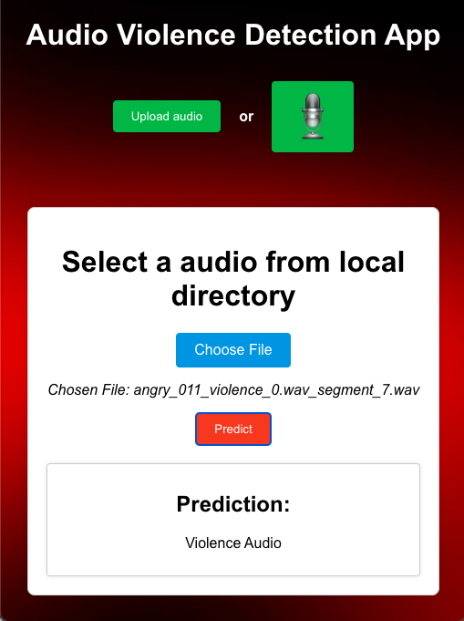

# Violence Detection Application

## Authors
Sarthak Jain

Orchid Chetia Phukan

## Contact
- Email: sarthakjainssjj@gmail.com or sarthakjainssjj@gmail.com
## Installation

Make sure you have Python and Node.js installed on your system.

1. Clone the repository:
    ```bash
    git clone https://github.com/SarthakJaindebugger/violenceDetection
    ```

2. Navigate to the project directory:
    ```bash
    cd depression_intensity
    ```

3. Create and activate a virtual environment:
    ```bash
    python -m venv venv
    source venv/bin/activate
    ```

4. Install the required packages using the following commands:
    ```bash
    pip install Flask
    pip install speechbrain
    pip install torchaudio
    pip install numpy
    pip install scikit-learn
    pip install tensorflow
    pip install Werkzeug
    pip install pydub
    pip install Flask-CORS
    pip install soundfile
    pip install sox
    ```

5. Install ffmpeg:
    ```bash
    sudo apt-get install ffmpeg
    ```

## Steps to Start Flask Backend Server

1. Navigate to the project directory:
    ```bash
    cd Backend
    ```

2. Activate the virtual environment:
    ```bash
    source venv/bin/activate
    ```

3. Run the Flask server:
    ```bash
    flask run
    ```

## Steps to Run React Frontend Application

1. Navigate to the frontend directory:
    ```bash
    cd Frontend/src
    ```

2. Run the application using npm:
    ```bash
    npm start
    ```

Now, your Flask backend server should be up and running. You can access it at `http://127.0.0.1:5000/` in your web browser and your React frontend application should also be running. Access it at `http://localhost:3000/` in your web browser.


## Snapshot of the application




